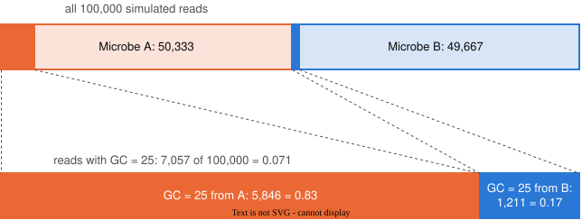

---
# Session 2 of unit 4, rebuilt 28 Sep 2026 for delivery Wed 30 Sep after the 28 Sep cancellation,
# and swept 29 Sep by the slide loop (bf550-instructor decisions/slide-loop-skill.md): a listener
# review as the reference student and a rulebook review, applied in one pass.
#
# The four pieces of Bayes' theorem, built in the order the chapter's revised "Playing with the
# story" builds them: likelihood, posterior, prior, probability of the data; then the rare-A beat,
# which is still "Playing with the story"; then "Where the numbers come from" (the rebuild, the
# two-priors check, the Toolbox); then "The notation". That is the chapter's order
# (decisions/lectures-follow-chapter-order.md). One beat: *Predict the split when A is rare*.
# The run-sheet (bf550-instructor lectures/unit04-runsheet.md) owns the clock and cites these
# headings.
#
# Chapter chunks are reused with the chapter's seeds (41 for the simulated reads, 43 for the rare-A
# community). The seed-41 simulated reads and the drawing helpers are rebuilt in a hidden chunk at
# the top, because each deck renders on its own; the printed numbers are the ones in the reading.
# Authored to the run-sheet: 47 minutes, 24 content slides (authoring/slides.md, Sizing a
# deck). The deck introduces every term it uses before the slide that uses it, because the
# reading is not assumed to have landed.
#
# Pseudocounts are not in this deck: they moved to chapter 5 on 28 Sep 2026
# (decisions/pseudocounts-move-to-ch05.md). The two illustrations come from
# img/illustrations/, copied by tools/illustrate.py sync-decks.
#
# Two words the chapter uses and the deck does not, pending the instructor's ruling under
# AUTHORING.md convention 18: "gate" for a step of the story and "wrote" for an organism
# producing a read. The deck says "step" and "produced".
title: "Mix: which process produced this observation?"
subtitle: "BF550 · Unit 4 · Session 2 — Wed Sep 30"
---

```{python}
#| echo: false
import numpy as np
import matplotlib.pyplot as plt
from matplotlib.patches import FancyBboxPatch

def draw_gc_from_two_groups(share_a, gc_a, gc_b, n_bases, rng):
    if rng.random() < share_a:
        return "A", rng.binomial(n_bases, gc_a)
    return "B", rng.binomial(n_bases, gc_b)

rng = np.random.default_rng(41)
species_list, gc_list = [], []
for _ in range(100000):
    s, g = draw_gc_from_two_groups(0.5, 0.66, 0.48, 40, rng)
    species_list.append(s)
    gc_list.append(g)
species = np.array(species_list)
gc = np.array(gc_list)
is_a = (species == "A")
is_b = (species == "B")
observed = 25

def fraction_boxes(title, is_a, is_b, gc, observed, per_organism):
    n_all = (gc == observed).sum()
    fig, ax = plt.subplots(figsize=(8, 3.0))
    ax.set_xlim(0, 10)
    ax.set_ylim(0, 3.0)
    ax.axis("off")
    ax.text(0.15, 2.75, title, fontsize=14, fontweight="bold", color="#0b0b0b", va="center")
    for y, name, mask, color in ((1.45, "A", is_a, "#eb6834"), (0.15, "B", is_b, "#2a78d6")):
        n_match = (gc[mask] == observed).sum()
        n_all = mask.sum() if per_organism else (gc == observed).sum()
        words = rf"all\ Microbe\ {name}\ reads" if per_organism else rf"all\ reads\ with\ GC = {observed}"
        value = f"{n_match / n_all:.3f}" if per_organism else f"{n_match / n_all:.2f}"
        top = f"{n_match:,}".replace(",", "{,}")
        bottom = f"{n_all:,}".replace(",", "{,}")
        ax.add_patch(FancyBboxPatch((0.15, y), 9.7, 1.0, boxstyle="round,pad=0.02,rounding_size=0.12",
                                    facecolor=color + "2E", edgecolor=color, lw=2))
        ax.text(0.45, y + 0.5, f"Microbe {name}", color=color, fontsize=13, fontweight="bold",
                va="center")
        ax.text(2.55, y + 0.5,
                rf"$\dfrac{{\mathrm{{Microbe\ {name}\ reads\ with\ GC = {observed}}}}}{{\mathrm{{{words}}}}}"
                rf"\;=\;\dfrac{{{top}}}{{{bottom}}}\;=\;{value}$",
                color="#0b0b0b", fontsize=12, va="center")
    plt.show()

def stacked_subset(species, gc, observed, a_label_xy, b_label_xy):
    is_a = (species == "A")
    is_b = (species == "B")
    subset = (gc == observed)
    from_a = (species[subset] == "A")
    from_b = (species[subset] == "B")
    fig, ax = plt.subplots(figsize=(7, 3.2))
    bins = np.arange(5.5, 40.5, 1)
    ax.hist([gc[is_a], gc[is_b]], bins=bins, stacked=True, alpha=0.3,
            color=["#eb6834", "#2a78d6"], label=["from A", "from B"])
    ax.bar(observed, from_a.sum(), width=1, color="#eb6834")
    ax.bar(observed, from_b.sum(), bottom=from_a.sum(), width=1, color="#2a78d6")
    ax.annotate(f"{from_a.sum():,} from A = {from_a.mean():.2f}", xy=(observed + 0.5, from_a.sum() / 2),
                xytext=a_label_xy, color="#eb6834", arrowprops=dict(arrowstyle="-", color="#52514e", lw=1))
    ax.annotate(f"{from_b.sum():,} from B = {from_b.mean():.2f}", xy=(observed + 0.5, from_a.sum() + from_b.sum() / 2),
                xytext=b_label_xy, color="#2a78d6", arrowprops=dict(arrowstyle="-", color="#52514e", lw=1))
    ax.set_xlabel("G or C bases, out of 40")
    ax.set_ylabel("reads")
    ax.legend(frameon=False, loc="upper left")
    ax.spines[["top", "right"]].set_visible(False)
    plt.show()
```

## Check-in {.smaller}

**[bf550.link/checkin](https://bu-cds-bf550.github.io/checkin/?session=11)** · `?session=11`

Closed book, no AI, five minutes.

::: {.notes}
The standing frame, verbatim. Code-reading kind, bank `checkins/unit04/bank.md` session 2: a
filtering computation on two aligned arrays at hand size, the constructs being Friday's mask and
lab 10. Read the edge tally, question 3, before *Keep the reads that look like the observed one*;
it is the same question asked of a ten-element array, and a weak tally there says to slow that
slide down.
:::

# Which organism produced this read?

## Friday: the same read scored 0.84, then 0.21

The same 25-GC read. The same two genomes.

. . .

Two communities: **0.84** when A was half, **0.21** when A was one in twenty.

. . .

Today: where those two numbers come from, piece by piece.

::: {.notes}
Two minutes, one slide of callback. Then, no slide: who has PS4 running and where the first white
check cell is. Say that the lecture builds four pieces, one at a time, and puts them together
into one formula at the end; do not name the pieces yet. Today's arithmetic lands on 0.83 and
0.20, a hundredth off Friday's numbers, and a slide near the end shows why. Friday's close
promised where 0.66 came from and where counting fails quietly; both left this session with the
rebuild, and the zero is chapter 5's.
:::

## Bayes' theorem has four pieces, and today builds each

**Bayes' theorem**: the formula that gives the posterior from three other pieces.

. . .

Likelihood · posterior · prior · the probability of the data.

. . .

Each is a **fraction counted from the simulated reads**; the four differ in **what is counted over what**.

::: {.notes}
Ninety seconds, the map. The name in the heading is new, so the first line says what it is. Four
words follow; three of them were said on Friday and one is new. The sentence to plant is the last
one: every piece is a count over a count, and what sits on top and underneath tells them apart.
The room will see that literally, in the same picture drawn three times.
:::

# The likelihood

## Both organisms can produce a 25-GC read

```{python}
#| echo: false
#| fig-align: center
from scipy.special import gammaln

def smooth_binomial(k, n, p):
    log_choose = gammaln(n + 1) - gammaln(k + 1) - gammaln(n - k + 1)
    return np.exp(log_choose + k * np.log(p) + (n - k) * np.log(1 - p))

counts = np.linspace(0, 40, 801)
fig, ax = plt.subplots(figsize=(7, 3.2))
ax.plot(counts, smooth_binomial(counts, 40, 0.66), color="#eb6834", lw=2)
ax.plot(counts, smooth_binomial(counts, 40, 0.48), color="#2a78d6", lw=2)
ax.text(31, 0.085, "Microbe A, 66% GC", color="#eb6834")
ax.text(15, 0.085, "Microbe B, 48% GC", color="#2a78d6", ha="right")
ax.axvline(25, color="#52514e", ls=":", lw=1.5)
ax.text(25.4, ax.get_ylim()[1] * 0.93, "observed read", color="#52514e")
ax.set_xlabel("G or C bases, out of 40")
ax.set_ylabel("expected share of reads")
ax.spines[["top", "right"]].set_visible(False)
plt.show()
```

::: {.notes}
Ninety seconds. The chapter's opening figure: the shape Friday's histogram approaches, worked
out from 66% and 48% alone, with no reads drawn. Point at the dotted line and read the two curves
there: A's is higher, B's is lower and not zero. The question "which organism?" is a question
because of that overlap.
:::

## The likelihood: how often an organism produces a 25-GC read

How often does Microbe A produce a read with 25 of 40 bases G or C?

. . .

Count it **inside A's own reads**: A's reads at 25, over all of A's reads.

. . .

That fraction is A's **likelihood** for the read.

. . .

B has its own likelihood, counted inside B's reads.

::: {.notes}
Two minutes, the first naming slide, and a repeat of Friday's word with a definition the room can
compute. Say the denominator aloud: all of A's reads, not all reads. The likelihood is a property
of the organism and the read together. The next slide counts it.
:::

## Count the likelihood inside each organism's own reads {.smaller}

```{python}
#| echo: true
# Friday's 100,000 simulated reads at seed 41: `species` says which organism, `gc` the GC count
is_a = (species == "A")          # Friday's mask: True for each read from A
is_b = (species == "B")
observed = 25
n_a = is_a.sum()
n_b = is_b.sum()
count_a_25 = (gc[is_a] == observed).sum()
count_b_25 = (gc[is_b] == observed).sum()
print(f"Microbe A reads with GC of {observed}: {count_a_25} of {n_a}, likelihood {count_a_25 / n_a:.3f}")
print(f"Microbe B reads with GC of {observed}: {count_b_25} of {n_b}, likelihood {count_b_25 / n_b:.3f}")
```

::: {.notes}
Two minutes. Run it live. The first four lines name what the room is looking at: Friday's arrays,
Friday's mask, and the read. `is_a.sum()` counts the Trues, so it is the number of reads from A.
`gc[is_a]` keeps A's reads only, and `== observed` asks each of them whether it landed on 25.
5,846 of 50,333 and 1,211 of 49,667: A produces such a read about 0.116 of the time, B about
0.024. Nearly five to one.
:::

## Likelihood: each organism's 25-GC reads over its own reads

```{python}
#| echo: false
#| fig-align: center
fraction_boxes("Likelihood", is_a, is_b, gc, observed, per_organism=True)
```

::: {.notes}
Ninety seconds. The chapter's first fraction figure, and the picture the deck redraws twice
more with a different denominator. Read each box aloud as a sentence. Leave it on screen long
enough that the shape is familiar; the next time it appears only the denominator will have
changed.
:::

# The posterior

## The collaborator asked: given this read, which organism?

The likelihood says how often **A produces** a read like this one.

. . .

The collaborator asked the opposite: given **this read**, which organism produced it?

. . .

To answer that, keep the simulated reads that look like it, and ask which organism produced them.

. . .

The reads we keep are a **subset**: a part of the 100,000 simulated reads.

::: {.notes}
Ninety seconds, the turn. The sentence Friday did not land is that the two questions are
opposites. In the likelihood the organism is known and the read is scored; in the collaborator's
question the read is known and the organism is scored. Say it both ways. The last line puts the
word *subset* in place, because the next six slides use it.
:::

## Keep the reads that look like the observed one {.smaller}

```{python}
#| echo: true
looks_like_observed = (gc == observed)
n_matching = looks_like_observed.sum()
from_a = (species[looks_like_observed] == "A")
from_b = (species[looks_like_observed] == "B")
print(f"simulated reads with GC of {observed}: {n_matching}")
print(f"fraction of all simulated reads with GC of {observed}: {looks_like_observed.mean():.3f}")
print(f"simulated reads with GC of {observed} from A: {from_a.sum()}")
print(f"simulated reads with GC of {observed} from B: {from_b.sum()}")
print(f"fraction of those from A:  {from_a.mean():.2f}")
print(f"fraction of those from B:  {from_b.mean():.2f}")
```

::: {.notes}
Two minutes. Friday's filter, run again, with two extra lines: the size of the subset as a
fraction of the simulated reads, 0.071, and the counts from each organism, 5,846 and 1,211. Read
the `.mean()` line aloud once: the mean of a mask is the fraction of Trues, so
`looks_like_observed.mean()` is the fraction of all reads in the subset. The room has seen 0.83
before; the new thing to notice is that 5,846 is the same number as on the likelihood slide.
:::

## The share of matching reads is the posterior

```{python}
#| echo: false
#| fig-align: center
fraction_boxes("Posterior", is_a, is_b, gc, observed, per_organism=False)
```

::: {.notes}
Two minutes, the second naming slide, after the demonstration. Same numerators as the likelihood
figure, 5,846 and 1,211. The denominator changed: all reads with GC = 25, the 7,057 we kept, for
both organisms. 0.83 and 0.17. A probability worked out with the read in hand is a **posterior**.
:::

## Likelihood and posterior count the same reads over different totals

Likelihood, 0.116: A's 25-GC reads over **all of A's reads**.

. . .

Posterior, 0.83: A's 25-GC reads over **all 25-GC reads**.

. . .

The likelihood counts how often A produces such a read.

. . .

The posterior counts which organism produced this one.

::: {.notes}
Ninety seconds, the contrast in one place. The slide to hold if the room is confused: two
fractions, same top, different bottom, opposite questions. Cut nothing before it.
:::

# The prior

## Before the read, "which organism?" is answered by A's share

With **no read in hand**, the probability a read came from A is A's share of the community: 0.5.

. . .

An answer to *which organism?* given **before** the read is a **prior**.

. . .

The posterior, 0.83, is the answer to the same question **after** the read is in hand.

. . .

In the 100,000 simulated reads, A's share came out as 50,333 of 100,000, **0.503**; the arithmetic uses that count.

::: {.notes}
Two minutes, the third naming slide. The prior is Friday's mixing proportion, renamed once it is
used as a probability. Prior and posterior are two answers to one question, before and after the
read. Do not say "before and after seeing the data": the likelihood also uses the data, and that
wording is the confusion the chapter's revision removed. The arithmetic later uses the share as
it came out of the simulation, 50,333 of 100,000, and the chunk prints it.
:::

## Prior and posterior name the organism, likelihood scores the read

Prior: which organism, knowing nothing about the read?

. . .

Posterior: which organism, knowing this read?

. . .

Likelihood: how often does this organism produce this read?

::: {.notes}
Ninety seconds, the sorting slide, and the chapter's own summary sentence. Three questions, three
words. If a student can say which question each word answers, the notation at the end will read
itself. Ask the room to say the three back before moving on.
:::

# The probability of the data

## The subset: 7,057 of 100,000 reads match the observed one

{fig-align="center" width="85%"}

::: {.notes}
Two and a half minutes, the fourth piece and the new one. Walk the picture top to bottom: the
whole set of simulated reads split by organism; the two solid slivers, each organism's 25-GC reads
at the left of its segment, to scale; the same subset enlarged, 5,846 from A and 1,211 from B. The
subset is 7,057 reads, 0.071 of all simulated reads.
:::

## The subset is one bar of the histogram

```{python}
#| echo: false
#| fig-align: center
stacked_subset(species, gc, observed, (30.5, 4200), (28.5, 8200))
```

::: {.notes}
Ninety seconds, the same subset one more way. Friday's histogram with the two organisms stacked
rather than overlaid: blue sits on top of orange, so B's count at any GC value is the thickness of
the blue band, not its height. The bar at 25 in full color is the subset, mostly orange with a
blue cap, and its split is the posterior.
:::

## The probability of the data is the subset's size

The data is the observed read: how often does a 25-GC read appear, from either organism?

. . .

As a count, **7,057**; as a fraction of all 100,000 reads, **0.071**.

. . .

Either form is the **denominator of the posterior**, under A's part and under B's part alike.

. . .

So the two shares add to one, and the subset's size cannot change which share is larger.

::: {.notes}
Two minutes, the naming slide for the fourth piece. A question about the community's reads as a
whole, not about either organism. Its role in this chapter is the denominator under both parts of
the subset; after the beat, the count and the fraction are shown to be the same denominator. Say the
last line slowly: dividing both parts by the same number cannot change which part is bigger.
:::

# The prior matters

## Predict the split when A is rare

The same read. The same two genomes. A is now **one read in twenty**.

. . .

We again keep the reads with 25 GC bases. Friday said 0.21 of them came from A.

. . .

**Predict first.** A produces such reads five times as often as B. How many B reads for every A read in this subset, and why?

::: {.notes}
Two minutes, the beat's predict pause; collect aloud and write it down. The room knows Friday's
0.21, so the question is the size and the reason, not the direction. The answer to listen for is
"five to one for A, because A's curve is higher at 25": the likelihood answering a question the
posterior was asked. The pieces are on the board: five to one for A per read, nineteen B reads
for every A read in the community, so about four B reads per A read in the subset.
:::

## When A is rare, the subset is mostly B's

```{python}
#| echo: false
#| fig-align: center
rng = np.random.default_rng(43)
rare_species_list, rare_gc_list = [], []
for _ in range(100000):
    s, g = draw_gc_from_two_groups(0.05, 0.66, 0.48, 40, rng)
    rare_species_list.append(s)
    rare_gc_list.append(g)
rare_species = np.array(rare_species_list)
rare_gc = np.array(rare_gc_list)
stacked_subset(rare_species, rare_gc, observed, (30.5, 3500), (29, 7500))
```

::: {.notes}
Two and a half minutes, the run, on the chapter's seed-43 community. The subset at 25 sits inside
B's distribution: 587 from A, 2,169 from B, about four B reads for every A read. A still produces
such reads five times as often per read, and there are nineteen times as many B reads. Mark the
board against the predictions.
:::

## Posterior when A is rare: 587 of 2,756

```{python}
#| echo: false
#| fig-align: center
fraction_boxes("Posterior when A is rare", rare_species == "A", rare_species == "B", rare_gc,
               observed, per_organism=False)
```

::: {.notes}
Ninety seconds, the same boxes on the rare community. 0.21 and 0.79, Friday's numbers, now with
their counts. The likelihoods are properties of the genomes and the genomes did not change; the
prior did, and the prior reaches the boxes through the counts. The next section does that
arithmetic with no simulation at all.
:::

# Prior times likelihood

## Prior times likelihood is A's part of the subset {.smaller}

```{python}
#| echo: true
prior_a, prior_b = is_a.mean(), is_b.mean()   # the mean of a mask: A's share of all reads
likelihood_a_25 = count_a_25 / n_a
likelihood_b_25 = count_b_25 / n_b
a_and_25 = prior_a * likelihood_a_25          # from A, and then lands on 25
b_and_25 = prior_b * likelihood_b_25
all_25 = a_and_25 + b_and_25                  # the size of the subset, rebuilt
print(f"A's share of all reads, the prior:            {prior_a:.3f}")
print(f"fraction of reads with 25 GC bases, rebuilt: {all_25:.5f}")
print(f"fraction of reads with 25 GC bases, counted: {looks_like_observed.mean():.5f}")
print(f"share of 25-GC reads that came from A:      {a_and_25 / all_25:.4f}")
```

::: {.notes}
Two and a half minutes. The prior line is the mean of a mask again: A's share as it came out,
50,333 of 100,000, prints as 0.503 rather than the 0.5 we set, and the counted share is what
makes the next slide exact. A read from A passed two steps, chosen from A and then landing on 25,
and a count along a two-step story is the product of the steps. The rebuilt subset, 0.07057, is
the counted one exactly; A's share is 0.8284, the filter's 0.83. Nothing was simulated here.
:::

## Prior times likelihood over the subset is the posterior, exactly

$$\frac{50{,}333}{100{,}000} \times \frac{5{,}846}{50{,}333} = \frac{5{,}846}{100{,}000}$$

. . .

$$\frac{5{,}846 / 100{,}000}{7{,}057 / 100{,}000} = \frac{5{,}846}{7{,}057} = 0.83$$

. . .

The 50,333 cancels, then the 100,000 cancels.

. . .

The arithmetic and the filter are **one procedure**.

::: {.notes}
Two and a half minutes, the slide the hour turns on. The prior's numerator is the likelihood's
denominator, so their product is A's 25-GC reads over all the simulated reads, which is A's part
of the subset. Divide by the subset and the 100,000 cancels too, which is why the subset's count
and its fraction are the same denominator. Write the cancellation on the board if the projector
is too small.
:::

## Two priors give two answers from one pair of likelihoods {.smaller}

```{python}
#| echo: true
for prior_a in (0.5, 0.05):
    prior_b = 1 - prior_a
    a_and = prior_a * likelihood_a_25
    b_and = prior_b * likelihood_b_25
    print(f"A's proportion {prior_a}: share of 25-GC reads from A = {a_and / (a_and + b_and):.2f}")
```

Friday's 0.84 and 0.21 came from a fresh 100,000 reads at seed 43; a fresh draw lands a hundredth away.

::: {.notes}
Two minutes. One pair of likelihoods, two priors, no new simulation: 0.83 and 0.20. The line
under the output settles the callback's numbers: Friday simulated a fresh community each time,
and a fresh simulation lands a hundredth away. The likelihoods alone could not have produced two
answers. The sentence for the room to leave with: the posterior depends on the read and on the
community.
:::

## The likelihood is one library call {.smaller}

```{python}
#| echo: true
from scipy.stats import binom

exact_a_25 = binom.pmf(25, 40, 0.66)     # probability of exactly 25 of 40: A's likelihood at 25
exact_b_25 = binom.pmf(25, 40, 0.48)     # B's likelihood at 25, from B's
print(f"A's likelihood at 25   counted: {likelihood_a_25:.3f}     exact: {exact_a_25:.3f}")
print(f"B's likelihood at 25   counted: {likelihood_b_25:.3f}     exact: {exact_b_25:.3f}")
```

When the story's settings are known, no reads need simulating.

`conda install scipy` in the course environment.

::: {.notes}
Two minutes. `binom.pmf(k, n, p)` is the probability of exactly k successes in n tries. The
counted and exact agree to the third decimal, and the exact needed no simulated reads. The
install line is on the slide because scipy is not in the lab environment yet. Libraries are the
required method from this unit on, and the next set names this call.
:::

# The notation

## Bayes' theorem is the four fractions in symbols

$$
\begin{aligned}
P(A \mid \text{read}) &= \frac{P(\text{read} \mid A)\,P(A)}{P(\text{read})} \\[6pt]
P(\text{read}) &= P(\text{read} \mid A)\,P(A) + P(\text{read} \mid B)\,P(B)
\end{aligned}
$$

. . .

Posterior · likelihood · prior · the probability of the data.

. . .

The four pieces, in one line.

::: {.notes}
Two and a half minutes, a binding slide and not first exposure. Point each symbol at the number
it was on the previous slides: P(A) is 0.503, printed by the rebuild chunk; P(read | A) is 0.116;
P(read) is 0.071; P(A | read) is 0.83. The vertical bar is unit 3's "given". The second line is
the subset as A's part plus B's part, which the rebuild chunk printed.
:::

## P(read | A) and P(A | read) ask opposite questions

$P(\text{read} \mid A)$ takes the **organism** as given: how often does A produce such a read?

. . .

$P(A \mid \text{read})$ takes the **read** as given: which organism produced this one?

. . .

What sits to the right of the bar is what is taken as known.

::: {.notes}
Two minutes, and the most common confusion in the unit, now in symbols after it was said in
words. The likelihood and the posterior are the two fractions with the same numerator; the bar
records which denominator. Cut this slide first if the clock slips, since the words version
already landed.
:::

## Working time — the rest of today

1. **Lab 11** — [unit-04-2.ipynb](https://github.com/bu-cds-bf550/bf550-unit04-labs/blob/main/unit-04-2.ipynb)
2. PS4

::: {.notes}
Lab 11 is *Keep the reads that match*: the chapter's own simulator and filtering chunk at seed
41, then the filtering fraction written as a function from a blank cell. Its empty-match snag is
worth a sentence: a count of zero says how long you looked, and chapter 5 takes that up. Thirty-
five minutes is the floor and this block has forty-five, so there is room. Then PS4.
:::

## Before next session

- **Next session:** *When the model is wrong* and *What do we tell our collaborator?*
- PS4 is due at the **start of the session after next** (was Fri Oct 2; the new date is announced in class)

::: {.notes}
The next session opens with a function read cold that leaves the prior out, then the session
that answers the collaborator's question and closes the chapter. The calendar has shifted a day
since the 28 Sep cancellation; say the PS4 due date aloud once it is settled. Read the two named
sections before then.
:::
