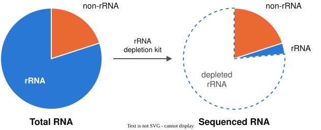
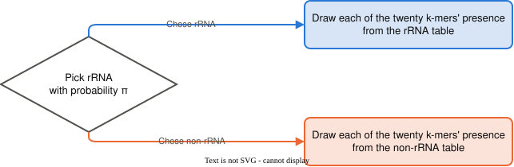

---
# Session 1 of unit 5. The problem, the two-step story with independence chosen and named, the
# story as code, and one read classified: the filter that finds no match, independence seen in
# counts, and the product that gives the read a posterior of 0.92. Two beats: *How many
# simulated reads match all twenty answers?* and *What does independence look like in counts?*.
# The run-sheet (bf550-instructor lectures/unit05-runsheet.md) owns the clock and cites these
# headings.
#
# Chapter chunks are reused with the chapter's seeds (61, 67, 126), in the chapter's order, so
# the numbers projected here are the numbers in the reading. Authored 29 Sep 2026 to the
# run-sheet: about 47 minutes, 23 content slides (authoring/slides.md, Sizing a deck). The deck
# introduces every term it uses before the slide that uses it, because the reading is not
# assumed to have landed; unit 4's prior, likelihood and posterior are recalled on their own
# slide before the story uses them.
#
# Dates: Mon 28 Sep was cancelled, and every meeting after it moved one place later. The
# subtitle and due dates follow the updated course/docs/schedule.md.
title: "Naive Bayes: classification as a generative story"
subtitle: "BF550 · Unit 5 · Session 1 — Mon Oct 5"
---

## The turn-in

PS4 was due at the door.

It asked for a herd-level scan, and a band that still holds under a second level of variation.

::: {.notes}
One sentence on what PS4 asked, now that it is in. Never its planted truth and never the key.
Then, no slide: what the room found hardest in PS4. Do not compare PS4's questions with PS5's.
Five minutes for this block. Say once, plainly, that PS5 opens today, at the end of the lecture.
:::

# Cleaning RNA reads

## Ribosomal RNA in transcriptome sequencing

A collaborator sequenced the RNA in a tissue sample and obtained 100,000 sequence reads.

. . .

Most RNA in a cell is **Ribosomal RNA** (**rRNA**), which builds the ribosome.

. . .

rRNA is useless for studying the thousands of other genes in the genome.

. . .

rRNA can be reduced in the sample using **rRNA depletion kits**.

. . .

rRNA depletion kits miss some of the rRNA, leaving them in the sequenced reads.

::: {.notes}
Two minutes, and no method yet. Most of a cell's RNA is rRNA. A read is a short piece of sequence from one molecule, as in
unit 4. Nobody knows which reads are the rRNA ones, and the collaborator wants them set aside
before anything downstream counts them. Say the word aloud, "r-R-N-A", so the room hears it
once before reading it.
:::

## Objective: identify and remove rRNA reads

Some of the reads we obtained came from rRNA molecules.

. . .

We seek to examine each read for evidence that it is a rRNA sequence and then
either **keep it** or **remove it** from downstream analysis.

. . .

Remove a read that was **not** rRNA: real signal is lost.

. . .

Keep a read that **was** rRNA: noise stays in every later count.

. . .

So every read needs two things:

- a call, rRNA or not
- a probability that says how far to trust the call

::: {.notes}
Two minutes. Ask the room which mistake is worse and let two people disagree; the answer depends
on what the analysis downstream needs, which is the collaborator's choice, and session 3 comes
back to it with numbers. The two bullets are the two halves of the question the whole unit
answers.
:::

## Depletion kits remove most rRNA but leave some behind

{fig-align="center" width="85%" fig-alt="Two pie charts joined by an arrow labeled rRNA depletion kit. The left pie, Total RNA, is mostly rRNA with a small non-rRNA wedge. The right pie, Sequenced RNA, keeps the same non-rRNA wedge, a thin rRNA sliver, and a large dashed empty region labeled depleted rRNA."}

::: {.notes}
One minute. The left pie is all the RNA in the tissue, most of it rRNA. The kit removes most of
the rRNA before sequencing; the dashed region is what it removed. The orange wedge is the same
size in both pies, because the kit leaves the non-rRNA alone. The thin blue wedge is the rRNA the
kit missed, and those reads are the ones this unit sets out to find. The wedge sizes are drawn,
not measured, though the sliver is 15% of what was sequenced, the share the simulator uses later.
:::

## rRNA genes are a specific family of DNA sequences

{TODO} 4-5 brief bullets on how the rRNA specific sequences have different content than protein coding genes, and that we will examine *sequence content* using *k-mers*

## A k-mer is a window of k bases

{fig-align="center" width="70%"}

. . .

A **k-mer**: a window of k bases, slid along the read one base at a time.

. . .

```{python}
read = "ATGCGTACGTTAGC"          # the 14-base read in the picture
n_windows = 0
for start in range(len(read) - 5):
    n_windows += 1
print("6-mers in this read:", n_windows, "   different 6-mers that exist:", 4 ** 6)
```

::: {.notes}
Two and a half minutes. Walk the staircase: window at start 0, then start 1, each box one base to
the right. The printed line: nine 6-mers in this read, and 4,096 different 6-mers, four possible
bases at each of six positions. The k in the name is the length of the window, here 6. Neighboring windows
share five of their six bases, and *Overlapping k-mers are dependent, and we assume independence anyway* comes back to that overlap.
:::

## Twenty present-or-absent answers make a read's profile

```{python}
#| fig-align: center
import matplotlib.pyplot as plt

# a profile chosen by hand, to show the shape of the data: 1 present, 0 absent
profile = [0, 1, 1, 0, 1, 0, 0, 1, 1, 1, 0, 1, 0, 0, 1, 1, 0, 1, 0, 1]

fig, ax = plt.subplots(figsize=(8, 1.5))
for i in range(20):
    if profile[i] == 1:
        face = "#2a78d6"
    else:
        face = "#ffffff"
    ax.add_patch(plt.Rectangle((i, 0), 1, 1, facecolor=face, edgecolor="#52514e", lw=1.2))
    ax.text(i + 0.5, -0.35, str(i), ha="center", va="top", fontsize=9, color="#52514e")
ax.text(-0.3, 0.5, "present", ha="right", va="center", color="#2a78d6")
ax.text(-0.3, -0.35, "k-mer", ha="right", va="top", fontsize=9, color="#52514e")
ax.set_xlim(-3, 20.2)
ax.set_ylim(-0.9, 1.1)
ax.axis("off")
plt.show()
```

A fixed **panel** of twenty k-mers, each present or absent in the read.

. . .

{TODO} add a couple examples of kmer mappings, e.g. k-mer 0 = ATGCGT, k-mer 1 = GTACGT, etc

. . .

The twenty answers are the read's **profile**.

::: {.notes}
Two minutes. The panel was chosen by an earlier analysis: each of the twenty k-mers is more
common in rRNA than in other RNA, or less common. Blue is present, white is absent, and the
panel's k-mers are numbered 0 to 19. This profile was typed in by hand to show the shape. How many
times a k-mer occurs is thrown away; only present or absent is kept.
:::

## Which class produced each read, and how sure are we?

Each read belongs to one of two **classes**: **rRNA** or **non-rRNA**, every other RNA.

. . .

For each of the 100,000 reads: which class produced it?

. . .

And is the answer confident enough to remove the read?

::: {.notes}
Ninety seconds, the question slide. The two questions are the two halves from *Objective: identify and
remove rRNA reads*: the call and the probability. Unit 4 answered the same question for one measurement
per read, and the next slide recalls its three words. Nothing is answered today until the lecture's
last slide, *The new read is rRNA with posterior 0.92*.
:::

## Unit 4 turned one measurement into a posterior

The **prior**: a class's share, before the read.

. . .

The **likelihood**: how often a class produces a read like this.

. . .

The **posterior**: the class's probability, after the read.

. . .

This unit uses twenty measurements per read.

::: {.notes}
Two minutes, the bridge from last unit's words. Unit 4 used one measurement per read, its GC
count. Unit 4 kept the simulated reads that matched the
observed GC count and read off the share from each organism; that share was the posterior. Say
that sentence, because the first beat today tries the same filter. If the room is shaky on the three
words, slow down here; everything today reuses them.
:::

# The story

## A read is made in two steps: class, then k-mers

{fig-align="center" width="75%"}

. . .

**Step 1.** rRNA with probability $\pi$, the prior share of rRNA; non-rRNA otherwise.

. . .

**Step 2.** Twenty yes-or-no draws: k-mer $i$ is present with probability $p_i$ if rRNA, $q_i$ if not.

. . .

A class's twenty probabilities are its **table**.

::: {.notes}
Two and a half minutes, the model itself. Keep the reveals moving; the picture's π and tables are
named on the next two lines. Step 1 is unit 4's step 1 with new names: there Microbe A and Microbe
B, here rRNA and non-rRNA. Step 2 is twenty draws, one per k-mer, each from the class's own table.
Point at the two boxes in the picture as the two tables.
:::

## Independent draws leave each other's probabilities unchanged

Two draws are **independent** when one answer leaves the other's probability unchanged.

. . .

Given the class: k-mer 3 present leaves k-mer 4 at $p_4$.

. . .

In counts: among rRNA reads **with** k-mer 3, k-mer 4's share equals its share among **all** rRNA
reads.

. . .

In the story, the twenty draws are independent given the class.

::: {.notes}
Two minutes, the definition of the unit's central assumption. Give a second example aloud: two
separate coin flips are independent; whether it rains today and whether the ground is wet are
not. "Given the class" matters: the rRNA table and the non-rRNA table differ, so the class itself
changes the probabilities.
:::

## Overlapping k-mers are dependent, and we assume independence anyway

Neighboring k-mers share five of six bases.

. . .

So a read with one k-mer is likely to have its neighbors.

. . .

For real reads, the story's independence is false.

. . .

We assume it anyway, because it makes the calculation possible.

::: {.notes}
Two minutes. Go back to the staircase if it helps: windows at start 0 and start 1 share five
bases. Every model simplifies the process that made the data; this simplification is chosen with
knowing where it fails. Session 3 measures the cost in numbers. Do not defend the assumption
further today.
:::

## Assuming independence given the class is called naive Bayes

**Bayes**: the call is unit 4's posterior calculation.

. . .

**Naive**: the twenty k-mers are assumed independent given the class.

. . .

Together, the model is called **naive Bayes**.

. . .

A method that assigns each read a class is a **classifier**, and naive Bayes is one.

::: {.notes}
Ninety seconds, the naming slide, after the story. The adjective names which false assumption was
chosen. Some rooms hear "naive" as an insult; it is the field's name, used in software and papers,
and it describes the independence assumption only.
:::

# The story, as code

## A dictionary stores each value under a name {.smaller}

```python
shares = {"rRNA": 0.15, "non-rRNA": 0.85}
shares["rRNA"]        # 0.15
```

. . .

A **dictionary** stores values under names, called **keys**.

. . .

A list is looked up by position, `[0.15, 0.85][1]`; a dictionary by name, `shares["rRNA"]`.

::: {.notes}
Two minutes, the construct before the chunk that uses it; first cut if the clock is behind, to a
sentence over the next slide. Read the second line aloud: the value stored under the key "rRNA".
The next slide stores the two tables in a dictionary, so `presence_prob[label]` reads as "the
table stored under this read's label". Part 1 of the unit 5 lab is dictionaries; say so.
:::

## The story's two steps are two blocks of code {.smaller}

```{python}
#| echo: true
import numpy as np

rng = np.random.default_rng(61)
# the model's settings: one presence probability per k-mer, for each class
presence_prob = {"rRNA":     rng.uniform(0.15, 0.85, size=20),
                 "non-rRNA": rng.uniform(0.15, 0.85, size=20)}

def draw_labeled_read(share_rrna, presence_prob, rng):
    """One read from the model: its class, then which of the 20 k-mers it contains."""
    # step 1: draw the class
    if rng.random() < share_rrna:
        label = "rRNA"
    else:
        label = "non-rRNA"
    # step 2: draw each k-mer's presence, using the class's own probabilities
    present = rng.random(20) < presence_prob[label]
    return label, present
```

::: {.notes}
Two and a half minutes. Seed 61, the chapter's. The forty probabilities are drawn once, between
0.15 and 0.85, and stay fixed for the unit. Read `rng.random() < share_rrna` aloud as "true with
probability share_rrna": step 1. The `present` line is step 2, twenty random numbers compared with
twenty probabilities, unit 4's mask. `return label, present` returns two values, as unit 4's
function did.
:::

## A hundred thousand simulated reads are 15% rRNA {.smaller}

```{python}
#| echo: true
#| output-location: slide
rng = np.random.default_rng(67)
label_list, reads = [], []
for _ in range(100000):
    label, present = draw_labeled_read(0.15, presence_prob, rng)
    label_list.append(label)
    reads.append(present)
labels = np.array(label_list)
print("share of reads that are rRNA:    ", (labels == "rRNA").mean())
print("share of reads that are non-rRNA:", (labels == "non-rRNA").mean())
print("first read:", labels[0], reads[0].astype(int))
```

::: {.notes}
Two minutes, seed 67. The share is set to 0.15, what an imperfect kit leaves behind.
`label, present = ...` unpacks the two values the function returns. The output screen shows
0.14974, within a thousandth of 0.15, and the first read, non-rRNA, with its twenty answers as
ones and zeros; `.astype(int)` turns True into 1 and False into 0.
:::

## Every simulated read carries its true label

We wrote the simulator, so every simulated read's class is known: it is **labeled**.

. . .

The collaborator has labeled reads too, each checked against known rRNA sequences.

. . .

The collaborator's own 100,000 reads carry no label.

::: {.notes}
Ninety seconds; second cut if the clock is behind, to one sentence. The simulated reads take the place
of the collaborator's labeled reads, the way unit 4's simulated reads took the place of the mock
community. The unlabeled 100,000 are the ones to classify. Session 2 trains the tables from
labeled reads; today the tables are the simulator's own settings.
:::

## No single k-mer separates the two classes

```{python}
#| fig-align: center
read_matrix = np.array(reads)
is_rrna = (labels == "rRNA")
fraction_rrna = read_matrix[is_rrna].mean(axis=0)
fraction_nonrrna = read_matrix[~is_rrna].mean(axis=0)

fig, ax = plt.subplots(figsize=(8, 3.2))
kmer = np.arange(20)
ax.bar(kmer - 0.2, fraction_rrna, width=0.4, color="#eb6834", label="rRNA reads")
ax.bar(kmer + 0.2, fraction_nonrrna, width=0.4, color="#2a78d6", label="non-rRNA reads")
ax.set_xlabel("k-mer")
ax.set_ylabel("fraction of reads\nwith the k-mer present")
ax.set_xticks(kmer)
ax.set_ylim(0, 1)
ax.legend(frameon=False)
ax.spines[["top", "right"]].set_visible(False)
plt.show()
```

::: {.notes}
Ninety seconds, the chapter's figure; third cut if the clock is behind. At most k-mers the two
bars differ, so most k-mers carry some information. At no k-mer is one bar near 1 and the other
near 0, so no single k-mer settles a read on its own; the twenty answers have to be read together.
:::

# Classifying one new read

## How many simulated reads match all twenty answers?

A new read from the same model, its class hidden:

```{python}
rng = np.random.default_rng(126)
new_label, new_read = draw_labeled_read(0.15, presence_prob, rng)
print("the new read's profile:", new_read.astype(int), "  present:", new_read.sum(), "of 20")
```

. . .

Unit 4 kept the simulated reads that matched the observed GC count.

. . .

Unit 4's warning: with twenty answers, almost no read matches all twenty.

. . .

**Predict first.** How many match all twenty, and are there enough to count a share?

::: {.notes}
Two and a half minutes, seed 126, the chapter's; the draw is hidden and only the profile shows,
13 of 20 present. Collect numbers aloud and write them on the board. "A handful, enough to count a
share" is the answer to listen for: "almost none" heard as a small number rather than zero. Do not
advance until somebody has committed to a number. Never cut this beat.
:::

## Not one simulated read matches all twenty answers {.smaller}

```{python}
#| echo: true
#| output-location: slide
n_matching = 0
for read in reads:
    # compare the twenty answers: True where this read agrees with the new read
    same = (read == new_read)
    # count the read as a match only if all twenty answers agree
    if same.sum() == 20:
        n_matching += 1
print("exact matches among 100,000 simulated reads:", n_matching)
```

::: {.notes}
Two minutes. Read the loop aloud: for each simulated read, compare the twenty answers, and count it
only if all twenty agree. The output screen says zero. Mark the board. The new read is an
ordinary draw from the model. The next slide counts why no read matches.
:::

## Twenty yes-or-no answers make over a million profiles {.smaller}

One answer: 2 profiles.

Two answers: 2 × 2 = 4.

Three answers: 2 × 2 × 2 = 8.

. . .

```{python}
for n_answers in (1, 2, 5, 10, 20):
    # each yes-or-no answer doubles the number of possible profiles
    print(f"{n_answers:>2} answers: {2 ** n_answers:>9,} profiles")
```

. . .

100,000 ÷ 1,048,576 ≈ 0.1: the reads fill at most a tenth of the profiles.

::: {.notes}
Two minutes; fourth cut if the clock is behind, to the arithmetic reveals. Each answer doubles the
count. Read the table: 1,048,576 at twenty. In unit 4 one measurement had few possible values, and
thousands of reads matched each one. Here unit 4's filter stops working: counting matches cannot
classify a read once the panel is large.
:::

## What does independence look like in counts? {.smaller}

Among the rRNA reads, count k-mer 0, k-mer 1, and **both**.

**Predict first.** If the two are independent, how does the share with both compare with the
other two?

```{python}
#| echo: true
#| output-location: slide
n_rrna = 0
has_0, has_1, has_both = 0, 0, 0
for read, label in zip(reads, labels):
    if label == "rRNA":
        n_rrna += 1
        if read[0]:
            has_0 += 1
        if read[1]:
            has_1 += 1
        if read[0] and read[1]:        # True only when both are True
            has_both += 1
print(f"rRNA reads with k-mer 0 present:  {has_0 / n_rrna:.3f}")
print(f"rRNA reads with k-mer 1 present:  {has_1 / n_rrna:.3f}")
print(f"rRNA reads with both present:     {has_both / n_rrna:.3f}")
print(f"product of the first two:         {(has_0 / n_rrna) * (has_1 / n_rrna):.3f}")
```

::: {.notes}
Three minutes: one for the prediction, two for the run. Read `zip(reads, labels)` aloud as "each
read with its label", and `read[0] and read[1]` as "the read has k-mer 0 and also k-mer 1". Wrong
answers to listen for: "both is the smaller of the two", or "the two added". The output screen
prints 0.412, 0.691, then 0.285 for both, and 0.284 for the product. Never cut this beat.
:::

## A profile's probability is a product of twenty factors

Both, 0.285; each times each, 0.284.

For independent draws, **both is each times each**: 0.412 × 0.691.

. . .

So one rRNA profile's probability multiplies twenty factors:

- $p_i$ for each k-mer $i$ that is present
- $1 - p_i$ for each k-mer $i$ that is absent

. . .

No matching read is needed.

::: {.notes}
Two minutes, the correction and the arithmetic before the run. $p_i$ is the class's table entry
for k-mer $i$. Multiplying gave "both" here because the simulator made the draws independent;
session 3 runs the same check where they are not. Each factor is a per-k-mer fraction like the
two just counted, so a whole profile's probability comes from twenty fractions and never from a
match.
:::

## The likelihood function multiplies one factor per k-mer {.smaller}

```{python}
#| echo: true
#| output-location: slide
def likelihood(present, probs):
    """P(profile | class) under independence: one factor per k-mer."""
    likelihood_p = 1.0
    for i in range(len(probs)):
        if present[i]:
            likelihood_p = likelihood_p * probs[i]
        else:
            likelihood_p = likelihood_p * (1 - probs[i])
    return likelihood_p

like_rrna = likelihood(new_read, presence_prob["rRNA"])
like_nonrrna = likelihood(new_read, presence_prob["non-rRNA"])
# the posterior, as in unit 4: likelihood times share, divided by the total
posterior_rrna = like_rrna * 0.15 / (like_rrna * 0.15 + like_nonrrna * 0.85)
print(f"P(profile | rRNA)     = {like_rrna:.2e}")
print(f"P(profile | non-rRNA) = {like_nonrrna:.2e}")
print(f"ratio, rRNA to non-rRNA: {like_rrna / like_nonrrna:.0f} to 1")
print(f"P(rRNA | profile)     = {posterior_rrna:.3f}")
print(f"posterior odds, rRNA to non-rRNA: {posterior_rrna / (1 - posterior_rrna):.0f} to 1")
print("the read's true label:", new_label)
```

::: {.notes}
Two and a half minutes. `len(probs)` is the number of k-mers in the table, twenty. The loop is
the product from the slide before, one factor per k-mer. The last print is the posterior odds,
glossed two slides on: rRNA's probability over non-rRNA's. The posterior line is unit 4's arithmetic
unchanged: likelihood times share, over the total. P(profile | rRNA) reads "the probability of the
profile, given rRNA".
:::

## The new read is rRNA with posterior 0.92

`3.65e-06` means 3.65 × 10⁻⁶: about four in a million.

. . .

The likelihoods favor rRNA **67 to 1**.

. . .

Prior odds, rRNA's share over non-rRNA's: 0.15 ÷ 0.85 ≈ 0.18.

. . .

67 × 0.18 ≈ 12 to 1.

. . .

12 to 1 is 12 rRNA reads in every 13: 12 ÷ 13 ≈ **0.92**.

. . .

The read's true label is rRNA.

::: {.notes}
Two and a half minutes. Both likelihoods are tiny because twenty numbers below 1 were multiplied.
The prior odds, 0.18, bring 67 to 1 down to 12 to 1, because rRNA is only 15% of reads. The other 0.08 matters for the
collaborator: under the model, about 8 in 100 reads with this profile are non-rRNA, so deleting
every such read removes some real signal. Session 2's first slide starts from this 0.92; never cut
this slide.
:::

## PS5 opens today

**Problem Set 5**, on unit 4's material.

A DNA extract that mixes two sources, and the share that comes from each.

. . .

Graded on the checks passing and on your answers.

From this set on, **you write the check cells**.

. . .

**Due Tue Oct 13, start of class.**

::: {.notes}
Title and one teaser sentence only; the notebook carries the problem and its *More background*.
Say the set's title aloud. One sentence on the check cells: the notebook gives three stated cases
per check, and turning them into a check cell is the student's work from now on. Never the planted
truth of its data; the run-sheet's *Do not give away* block holds the reserved terms, and this
file is public.
:::

## Working time — the rest of today

1. Accept the unit's labs:
   `gh student accept bu-bioinfo-classrooms bf550-fall-2026 bf550-unit05-labs`
2. **Unit 5 lab**, part 1: dictionaries — [unit-05.ipynb](https://github.com/bu-cds-bf550/bf550-unit05-labs/blob/main/unit-05.ipynb)
3. PS5

::: {.notes}
The unit 5 lab is one notebook, `unit-05.ipynb`, worked across all three sessions. Today is part 1,
questions 1 to 3: dictionaries and `len`, two lookups in a row through a dictionary of
dictionaries, and counting into a dictionary. Thirty-five minutes is the floor, and this block has
thirty-seven, so the lecture ending at 0:59 is a hard mark. Then PS5.
:::

## Before next session

- **Next session:** where the tables come from, what a small labeled set does to them, and how to
  grade the classifier
- PS5 is open, due **Tue Oct 13**, start of class

::: {.notes}
Say the due date out loud: Tue Oct 13 is BU's Monday-schedule day and unit 6's first session.
Chapter 5's practice problems ship with worked solutions and are not assigned this offering;
mention them once as extra reading and assign nothing.
:::
