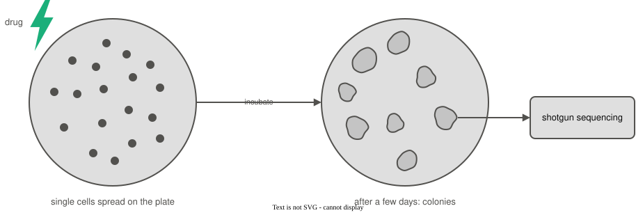
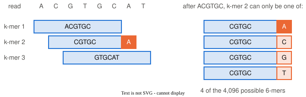

```{python}
#| echo: false
# Session 1's model, simulated reads, new read and likelihood function, rebuilt with the
# chapter's seeds so that this deck's numbers are the chapter's.
import numpy as np

rng = np.random.default_rng(61)
presence_prob = {"rRNA":     rng.uniform(0.15, 0.85, size=20),
                 "non-rRNA": rng.uniform(0.15, 0.85, size=20)}

def draw_labeled_read(share_rrna, presence_prob, rng):
    if rng.random() < share_rrna:
        label = "rRNA"
    else:
        label = "non-rRNA"
    present = rng.random(20) < presence_prob[label]
    return label, present

rng = np.random.default_rng(67)
label_list, reads = [], []
for _ in range(100000):
    label, present = draw_labeled_read(0.15, presence_prob, rng)
    label_list.append(label)
    reads.append(present)
labels = np.array(label_list)

rng = np.random.default_rng(126)
new_label, new_read = draw_labeled_read(0.15, presence_prob, rng)

def likelihood(present, probs):
    likelihood_p = 1.0
    for i in range(len(probs)):
        if present[i]:
            likelihood_p = likelihood_p * probs[i]
        else:
            likelihood_p = likelihood_p * (1 - probs[i])
    return likelihood_p

like_rrna = likelihood(new_read, presence_prob["rRNA"])
like_nonrrna = likelihood(new_read, presence_prob["non-rRNA"])
posterior_given = like_rrna * 0.15 / (like_rrna * 0.15 + like_nonrrna * 0.85)

# The method block's three-measurement example. Every number it shows is printed from here,
# so nothing on those slides is typed by hand.
m_p = [0.80, 0.30, 0.60]          # P(answer i is yes | class A)
m_q = [0.20, 0.70, 0.50]          # P(answer i is yes | class B)
m_share_a, m_share_b = 0.40, 0.60
m_answers = [True, False, True]   # the object we observed: yes, no, yes

def m_factors(probs):
    out = []
    for i in range(3):
        if m_answers[i]:
            out.append(probs[i])
        else:
            out.append(1 - probs[i])
    return out

m_fac_a, m_fac_b = m_factors(m_p), m_factors(m_q)
m_like_a = m_fac_a[0] * m_fac_a[1] * m_fac_a[2]
m_like_b = m_fac_b[0] * m_fac_b[1] * m_fac_b[2]
m_joint_a, m_joint_b = m_like_a * m_share_a, m_like_b * m_share_b
m_post_a = m_joint_a / (m_joint_a + m_joint_b)
m_post_b = m_joint_b / (m_joint_a + m_joint_b)

# Step 1: measurement 1 alone, for the one-measurement slide
m1_joint_a, m1_joint_b = m_share_a * m_p[0], m_share_b * m_q[0]
m1_total = m1_joint_a + m1_joint_b
m1_post_a, m1_post_b = m1_joint_a / m1_total, m1_joint_b / m1_total
m_total = m_joint_a + m_joint_b

# the 100-object table for the independence slide: class A, measurements 1 and 2
m_n = 100
m_cells = [[round(m_n * m_p[0] * m_p[1]), round(m_n * m_p[0] * (1 - m_p[1]))],
           [round(m_n * (1 - m_p[0]) * m_p[1]), round(m_n * (1 - m_p[0]) * (1 - m_p[1]))]]

# the cost slide: measurement 1 counted twice, with no new information
m_dbl_a = m_share_a * m_p[0] * m_p[0]
m_dbl_b = m_share_b * m_q[0] * m_q[0]
m_dbl_post_a = m_dbl_a / (m_dbl_a + m_dbl_b)

def f2(x):
    return f"{x:.2f}"

def f3(x):
    return f"{x:.3f}"

def f4(x):
    return f"{x:.4f}"

# Unit 4's 100,000 simulated reads at seed 41, for the counted likelihood, and its smooth GC curves
from math import comb
from scipy.stats import binom
from scipy.special import gammaln
import matplotlib.pyplot as plt

def draw_gc_from_two_groups(share_a, gc_a, gc_b, n_bases, rng):
    if rng.random() < share_a:
        return "A", rng.binomial(n_bases, gc_a)
    return "B", rng.binomial(n_bases, gc_b)

rng = np.random.default_rng(41)
species_list, gc_list = [], []
for _ in range(100000):
    s, g = draw_gc_from_two_groups(0.5, 0.66, 0.48, 40, rng)
    species_list.append(s)
    gc_list.append(g)
species = np.array(species_list)
gc = np.array(gc_list)
is_a = (species == "A")
n_a = is_a.sum()
count_a_25 = (gc[is_a] == 25).sum()

def smooth_binomial(k, n, p):
    log_choose = gammaln(n + 1) - gammaln(k + 1) - gammaln(n - k + 1)
    return np.exp(log_choose + k * np.log(p) + (n - k) * np.log(1 - p))

pmf_a_25 = binom.pmf(25, 40, 0.66)
pmf_b_25 = binom.pmf(25, 40, 0.48)
```

# Naive Bayes

## Likelihood of a single feature

```
ATGCACCCTGTGGGCGAGCTGCCTATCGGCCGAAATACGC
```

```{python}
#| echo: false
#| fig-align: center
counts = np.linspace(0, 40, 801)
fig, ax = plt.subplots(figsize=(7, 2.8))
ax.plot(counts, smooth_binomial(counts, 40, 0.66), color="#eb6834", lw=2)
ax.plot(counts, smooth_binomial(counts, 40, 0.48), color="#2a78d6", lw=2)
ax.text(31, 0.085, "Microbe A, 66% GC", color="#eb6834")
ax.text(15, 0.085, "Microbe B, 48% GC", color="#2a78d6", ha="right")
ax.axvline(25, color="#52514e", ls=":", lw=1.5)
ax.text(25.4, ax.get_ylim()[1] * 0.93, "observed read", color="#52514e")
ax.plot([25, 25], [pmf_a_25, pmf_b_25], "o", ms=6, color="#52514e")
ax.set_xlabel("G or C bases, out of 40")
ax.set_ylabel("expected share of reads")
ax.spines[["top", "right"]].set_visible(False)
plt.show()
```

```{python}
#| echo: false
#| output: asis
print(rf"$P(\text{{read}} \mid A) = {pmf_a_25:.3f}$ and $P(\text{{read}} \mid B) = {pmf_b_25:.3f}$")
```

## Likelihood of a single feature (cont.)

The read is the **instance**

. . .

The GC content is its only **feature**

. . .

We computed the likelihood of the read given Microbe A by:

```{python}
#| echo: false
#| output: asis
print(rf"$$P(\text{{read}} \mid A) = \frac{{\text{{A's reads with 25 G or C}}}}{{\text{{all of A's reads}}}}"
      rf" = \frac{{{count_a_25:,}}}{{{n_a:,}}} = {count_a_25 / n_a:.3f}$$".replace(",", "{,}"))
```

## GC is modeled as a binomial distribution

The binomial distribution models:

- the number of successes $k$ 
- in a fixed number of independent trials $n$
- that each have the same probability of success $p$

. . .

$$ k \sim \text{Binomial}(n, p) $$

. . .

In our read:

- $p = 0.66$ - the probability of success, the GC content of Microbe A
- $n = 40$ - the number of bases in the read
- $k = 25$ - the number of G or C bases in the read, the "successes"

## The binomial distribution has a closed form

$$ P(k \mid n, p) = \binom{n}{k} \, p^k \, (1 - p)^{n - k} $$

. . .

Plug in our values:

```{python}
#| echo: false
#| output: asis
def sci(x):
    mantissa, exponent = f"{x:.2e}".split("e")
    return rf"{mantissa} \times 10^{{{int(exponent)}}}"

n_choose_k = f"{comb(40, 25):,}".replace(",", "{,}")
print(rf"""$$
\begin{{aligned}}
P(25 \mid 40, 0.66) &= \binom{{40}}{{25}} \, 0.66^{{25}} \, (1 - 0.66)^{{15}} \\
&= {n_choose_k} \times {sci(0.66**25)} \times {sci(0.34**15)} \\
&= {pmf_a_25:.4f}
\end{{aligned}}
$$""")
```

. . .

```{python}
#| echo: false
#| output: asis
sim_frac = rf"\frac{{{count_a_25:,}}}{{{n_a:,}}}".replace(",", "{,}")
print(rf"From the simulation: ${sim_frac} = {count_a_25 / n_a:.4f}$, and the formula gives ${pmf_a_25:.4f}$")
```

## Probability Mass Functions

The function $P(k \mid n, p)$ is called a **probability mass function** (PMF)

```{python}
#| echo: false
#| fig-align: center
ks = np.arange(0, 41)
pmf_a = binom.pmf(ks, 40, 0.66)
bar_colours = ["#eb6834" if k == 25 else "#f5c3ad" for k in ks]
fig, ax = plt.subplots(figsize=(7, 2.8))
ax.bar(ks, pmf_a, width=0.8, color=bar_colours)
ax.annotate(rf"$k = 25$: {pmf_a_25:.3f}", xy=(25, pmf_a_25), xytext=(12, pmf_a_25 * 1.05),
            color="#eb6834", arrowprops=dict(arrowstyle="->", color="#eb6834"))
ax.set_xlabel("G or C bases $k$, out of $n = 40$")
ax.set_ylabel(r"$P(k \mid 40, 0.66)$")
ax.set_xlim(5, 40)
ax.set_title("Microbe A, 66% GC", color="#eb6834", loc="left")
ax.spines[["top", "right"]].set_visible(False)
plt.show()
```

It's called a "mass" function because the binomial distribution is discrete

. . .

The probability mass function returns the *likelihood* of any $k$, $n$, and $p$

## PMF in python {.smaller}

```{python}
#| echo: true
from scipy.stats import binom

# binom.pmf(k, n, p): the probability of exactly k successes in n trials
print(f"{binom.pmf(25, 40, 0.66):.4f}")    # our read under Microbe A
print(f"{binom.pmf(25, 40, 0.48):.4f}")    # the same read under Microbe B
print(f"{binom.pmf(25, 60, 0.66):.4f}")    # 25 G or C bases in a 60-base read
print(binom.pmf([20, 25, 30], 40, 0.66).round(4))   # several k at once
```

## The next experiment

Our collaborator streaked a mixture of Microbe A and Microbe B on a plate, then added a drug that kills one of the microbes 

We're not sure which one it killed, but we know that every surviving colony is the same microbe

{fig-align="center" width="90%"}

Which microbe survived?

## Two reads

We now sequenced two reads

```
>read1
ATGCACCCTGTGGGCGAGCTGCCTATCGGCCGAAATACGC
>read2
GTGCGGGCCACGCGGTGACCCATCTAGATGCGGGGTCTGC
```

. . .

The drug killed one of the microbes, so every surviving colony is the same microbe, and both reads come from it

. . .

Only one read left the probability of A at 0.83, we want to be more confident

. . .

Which microbe is more likely to have produced both reads?

## Joint probability

With two reads, we ask: if Microbe A survived, what is the probability of observing

- read1 **AND**
- read2?

. . .

The probability of two events happening together is called a **joint probability**

. . .

The notation is $P(\text{read1, read2} \mid A)$

## The chain rule splits a joint probability

Any joint probability can be split into two pieces:

$$P(\text{read1, read2} \mid A) = P(\text{read1} \mid A) \times P(\text{read2} \mid \text{read1}, A)$$

. . .

- $P(\text{read1} \mid A)$ is the likelihood of read1, as before
- $P(\text{read2} \mid \text{read1}, A)$ is the likelihood of read2, *given that we have already seen read1*

. . .

This is the **chain rule**, and it always holds: it makes no assumption about the reads

## The reads are independent given the microbe

Shotgun sequencing reads come from random places in the genome

. . .

If we know the survivor is Microbe A, read1's GC content tells us nothing new about read2's

. . .

The reads are **independent given the microbe**:

$$P(\text{read2} \mid \text{read1}, A) = P(\text{read2} \mid A)$$

. . .

So the joint probability is a product of the single-read likelihoods:

$$P(\text{read1, read2} \mid A) = P(\text{read1} \mid A) \times P(\text{read2} \mid A)$$

## Compute the likelihoods {.smaller}

```{python}
#| echo: true
from scipy.stats import binom

read1 = "ATGCACCCTGTGGGCGAGCTGCCTATCGGCCGAAATACGC"
read2 = "GTGCGGGCCACGCGGTGACCCATCTAGATGCGGGGTCTGC"
k1 = read1.count("G") + read1.count("C")     # G or C bases in read1
k2 = read2.count("G") + read2.count("C")     # G or C bases in read2

like1_a = binom.pmf(k1, 40, 0.66)            # P(read1 | A)
like2_a = binom.pmf(k2, 40, 0.66)            # P(read2 | A)
like1_b = binom.pmf(k1, 40, 0.48)            # P(read1 | B)
like2_b = binom.pmf(k2, 40, 0.48)            # P(read2 | B)

joint_a = like1_a * like2_a                  # P(read1, read2 | A)
joint_b = like1_b * like2_b                  # P(read1, read2 | B)
print(f"A: {like1_a:.4f} x {like2_a:.4f} = {joint_a:.6f}")
print(f"B: {like1_b:.4f} x {like2_b:.4f} = {joint_b:.6f}")
```

## Two reads are more convincing than one

```{python}
#| echo: false
# The two reads on the "Two reads" slide, scored under each microbe; the drug leaves an even
# prior over which one survived.
two_reads = ["ATGCACCCTGTGGGCGAGCTGCCTATCGGCCGAAATACGC",
             "GTGCGGGCCACGCGGTGACCCATCTAGATGCGGGGTCTGC"]
two_k = [sum(base in "GC" for base in read) for read in two_reads]
two_like_a = binom.pmf(two_k[0], 40, 0.66) * binom.pmf(two_k[1], 40, 0.66)
two_like_b = binom.pmf(two_k[0], 40, 0.48) * binom.pmf(two_k[1], 40, 0.48)
two_post_a = two_like_a * 0.5 / (two_like_a * 0.5 + two_like_b * 0.5)

def p4(x):
    """Four decimals, or scientific notation once four decimals would round it away."""
    return f"{x:.4f}" if x >= 0.001 else sci(x)

one_post_a = binom.pmf(two_k[0], 40, 0.66) / (binom.pmf(two_k[0], 40, 0.66) + binom.pmf(two_k[0], 40, 0.48))
```

read1 has `{python} two_k[0]` and read2 has `{python} two_k[1]` of their 40 bases G or C

. . .

```{python}
#| echo: false
#| output: asis
print(rf"""$$
\begin{{aligned}}
P(\text{{read1, read2}} \mid A) &= P(\text{{read1}} \mid A) \times P(\text{{read2}} \mid A) \\
&= {binom.pmf(two_k[0], 40, 0.66):.4f} \times {binom.pmf(two_k[1], 40, 0.66):.4f} \\
&= {p4(two_like_a)} \\[10pt]
P(\text{{read1, read2}} \mid B) &= P(\text{{read1}} \mid B) \times P(\text{{read2}} \mid B) \\
&= {binom.pmf(two_k[0], 40, 0.48):.4f} \times {binom.pmf(two_k[1], 40, 0.48):.4f} \\
&= {p4(two_like_b)}
\end{{aligned}}
$$""")
```

## Bayes theorem to compute the posterior

$P(\text{read1, read2} \mid A)$ is the likelihood of both reads under Microbe A

. . .

Applying Bayes' theorem:

$$\begin{aligned}
P(A \mid \text{read1, read2}) &= \frac{P(\text{read1, read2} \mid A) P(A)}{P(\text{read1, read2})} \\
&= \frac{P(\text{read1} \mid A) \; P(\text{read2} \mid A) P(A)}{P(\text{read1, read2})}
\end{aligned}
$$

. . .

$$\begin{aligned}
P(\text{read1, read2}) = &P(\text{read1, read2} \mid A) P(A) + \\
    &P(\text{read1, read2} \mid B) P(B)
\end{aligned}$$

## Two reads are more convincing than one

```{python}
#| echo: false
#| output: asis
print(rf"$$\begin{{aligned}} P(A \mid \text{{read1, read2}}) &= \frac{{{p4(like1_a)} \times {p4(like2_a)} \times 0.5}}{{{p4(two_like_a)} \times 0.5 + {p4(two_like_b)} \times 0.5}} \\ &= {two_post_a:.3f} \end{{aligned}} $$")
```


With one read, $P(A \mid \text{read1})$ was `{python} f"{one_post_a:.2f}"`; the second read raises it to `{python} f"{two_post_a:.3f}"`

. . .

```{python}
#| echo: false
#| output: asis
two_post_b = two_like_b * 0.5 / (two_like_a * 0.5 + two_like_b * 0.5)
print(rf"$$\begin{{aligned}} P(B \mid \text{{read1, read2}}) &= \frac{{{p4(like1_b)} \times {p4(like2_b)} \times 0.5}}{{{p4(two_like_a)} \times 0.5 + {p4(two_like_b)} \times 0.5}} \\ &= {two_post_b:.3f} \end{{aligned}} $$")
```

## Bayes classifier on two reads

Compare the two posteriors with their ratio; the evidence $P(\text{read1, read2})$ cancels

```{python}
#| echo: false
#| output: asis
two_ratio = two_post_a / two_post_b
one_ratio = one_post_a / (1 - one_post_a)
print(rf"""$$
\begin{{aligned}}
\frac{{P(A \mid \text{{read1, read2}})}}{{P(B \mid \text{{read1, read2}})}}
&= \frac{{P(\text{{read1, read2}} \mid A) \, P(A)}}{{P(\text{{read1, read2}} \mid B) \, P(B)}} \\
&= \frac{{{p4(two_like_a)} \times 0.5}}{{{p4(two_like_b)} \times 0.5}} = {two_ratio:.0f}
\end{{aligned}}
$$""")
```

. . .

The decision boundary is a ratio of 1:

- ratio >> 1 → classify the survivor as Microbe A

. . .

The ratio is `{python} f"{two_ratio:.0f}"`, far above 1, so the survivor is **Microbe A**; with read1 alone it was `{python} f"{one_ratio:.1f}"`

## Conditional independence

We assumed the two reads are independent *once we know the microbe*

. . .

Independence given something else, here the microbe, is called **conditional independence**

. . .

Without it, $P(\text{read1, read2} \mid A)$ needs a probability for every pair of GC counts: $41 \times 41 = 1{,}681$ of them, for each microbe

. . .

With it, we only need the one-read PMF, used twice

## Conditional independence (cont.)

In general, for features $x_1, x_2, \dots, x_n$ of an instance with class $y$:

$$
\begin{aligned}
P(x_1, x_2, \dots, x_n \mid y) &= P(x_1 \mid y) \times P(x_2 \mid y) \times \dots \times P(x_n \mid y) \\
&= \prod_{i=1}^{n} P(x_i \mid y)
\end{aligned}
$$

Here, $x_1$ and $x_2$ are the GC counts of read1 and read2, and $y$ is the microbe

## Naive Bayes

**Naive Bayes** is Bayes' theorem with one added assumption: the features are conditionally independent given the class

$$P(x_1, \dots, x_n \mid y) = \prod_{i=1}^{n} P(x_i \mid y)$$

. . .

The assumption is the "naive" part: in most real data it is **incorrect**

. . .

Features measured on the same instance are usually related, even within one class

## rRNA vs non-rRNA classification

A read's k-mers are its overlapping 6-base windows, as in session 1

. . .

{fig-align="center" width="90%"}

. . .

Neighbouring k-mers share five bases, so knowing k-mer 1 leaves only four possibilities for k-mer 2

. . .

That holds for rRNA and non-rRNA reads alike: the k-mers are **not** independent, even within a class

## Compute the likelihood of a read given each class {.smaller}

```{python}
#| echo: false
# Made-up probabilities that each of the previous slide's three k-mers appears in a read of each
# class. Every number on this slide is computed from this table.
toy_kmers = ["ACGTGC", "CGTGCA", "GTGCAT"]
toy_prob = {"rRNA":     [0.60, 0.56, 0.52],
            "non-rRNA": [0.03, 0.04, 0.03]}
toy_like = {c: toy_prob[c][0] * toy_prob[c][1] * toy_prob[c][2] for c in toy_prob}

def toy_likelihood(c):
    """The joint, the product of k-mer probabilities, and the numbers, for one class."""
    terms = " \\times ".join(rf"P(\texttt{{{k}}} \mid \text{{{c}}})" for k in toy_kmers)
    nums = " \\times ".join(f"{x:.2f}" for x in toy_prob[c])
    return (rf"P(\text{{read}} \mid \text{{{c}}}) &= "
            rf"P(\texttt{{ACGTGC}}, \texttt{{CGTGCA}}, \texttt{{GTGCAT}} \mid \text{{{c}}}) \\"
            "\n" rf"&= {terms} \\" "\n" rf"&= {nums} = {p4(toy_like[c])}")
```

The probability that each k-mer of the read `ACGTGCAT` appears in a read of each class:

```{python}
#| echo: false
#| output: asis
print(r"| k-mer | $P(\text{k-mer} \mid \text{rRNA})$ | $P(\text{k-mer} \mid \text{non-rRNA})$ |")
print("|:---:|:---:|:---:|")
for i, kmer in enumerate(toy_kmers):
    print(f"| `{kmer}` | {toy_prob['rRNA'][i]:.2f} | {toy_prob['non-rRNA'][i]:.2f} |")
```

. . .

```{python}
#| echo: false
#| output: asis
print(f"$$\n\\begin{{aligned}}\n{toy_likelihood('rRNA')}\n\\end{{aligned}}\n$$")
```

. . .

```{python}
#| echo: false
#| output: asis
print(f"$$\n\\begin{{aligned}}\n{toy_likelihood('non-rRNA')}\n\\end{{aligned}}\n$$")
```

## Naive Bayes classifier

```{python}
#| echo: false
# The previous slide's two likelihoods, with the chapter's prior: 15% of reads are rRNA.
toy_share = 0.15
toy_joint = {"rRNA": toy_like["rRNA"] * toy_share, "non-rRNA": toy_like["non-rRNA"] * (1 - toy_share)}
toy_evidence = toy_joint["rRNA"] + toy_joint["non-rRNA"]
toy_post = {c: toy_joint[c] / toy_evidence for c in toy_joint}
toy_ratio = toy_post["rRNA"] / toy_post["non-rRNA"]
```

Combine each likelihood with the prior: `{python} f"{toy_share:.0%}"` of reads are rRNA

. . .

```{python}
#| echo: false
#| output: asis
print(rf"""$$
\begin{{aligned}}
P(\text{{rRNA}} \mid \text{{read}}) &= \frac{{{p4(toy_like['rRNA'])} \times {toy_share}}}{{{p4(toy_like['rRNA'])} \times {toy_share} + {p4(toy_like['non-rRNA'])} \times {1 - toy_share:.2f}}} = {toy_post['rRNA']:.3f} \\[6pt]
P(\text{{non-rRNA}} \mid \text{{read}}) &= \frac{{{p4(toy_like['non-rRNA'])} \times {1 - toy_share:.2f}}}{{{p4(toy_like['rRNA'])} \times {toy_share} + {p4(toy_like['non-rRNA'])} \times {1 - toy_share:.2f}}} = {toy_post['non-rRNA']:.3f}
\end{{aligned}}
$$""")
```

. . .

```{python}
#| echo: false
#| output: asis
print(rf"$$\frac{{P(\text{{rRNA}} \mid \text{{read}})}}{{P(\text{{non-rRNA}} \mid \text{{read}})}} = {toy_ratio:,.0f} > 1$$".replace(",", "{,}"))
```

The ratio is above 1, so the read is classified as **rRNA**, and set aside

## Naive Bayes classifier (cont.)

Overlapping k-mers violate the assumption of conditional independence, yet naive Bayes is often a good classifier

. . .

**The call only needs the right winner, not perfectly accurate posterior** 

. . .

Features that are correlated under naive Bayes *counts the same evidence more than once*

. . .

**The cost is the confidence** -- the posteriors themselves are not trustworthy

. . .

Our read's three overlapping k-mers convey mostly the same information, so its posterior of `{python} f"{toy_post['rRNA']:.3f}"` claims more certainty than the read really gives

. . .

A posterior of 0.99 should mean the call is right 99 times in 100; under naive Bayes it is often right less often than that

## Next time

How good is our rRNA classifier?

. . .

We can count how often its calls are right: its **accuracy**